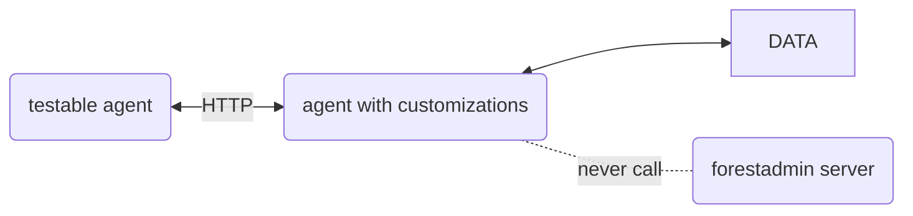

# Agent Node JS Testing Library

This library provides a set of utilities for testing Node JS agents.
It's only available for [Node JS agents](https://docs.forestadmin.com/developer-guide-agents-nodejs/).

It is in alpha version and is subject to breaking changes.
For the moment, it only provides an incomplete set of utilities for integration and unit testing, but it will be
extended in the future.

## Installation

```bash
npm install @forestadmin-experimental/agent-nodejs-testing
```

or for Yarn users

```bash
yarn add @forestadmin-experimental/agent-nodejs-testing
```

### Integration Tests - Recommended Testing Strategy

### Setup

```javascript
const { createTestableAgent } = require('@forestadmin-experimental/agent-nodejs-testing');

// customizations to apply to your agent
export function addAgentCustomizations(agent) {
  agent.addDataSource(createSequelizeDataSource(connection));
}

// setup and start a testable agent
export async function setupAndStartTestableAgent() {
  // if you have a database, or a server to start, do it here
  // ...

  // create a testable agent with the customizations
  const testableAgent = await createTestableAgent(addAgentCustomizations);

  // start the testable agent
  await testableAgent.start();

  return testableAgent;
}
```

### Usage

```javascript
describe('billing collection', () => {
  let testableAgent;

  beforeAll(async () => {
    testableAgent = await setupAndStartTestableAgent();
  });

  afterAll(async () => {
    await testableAgent?.stop();
  });

  it('should return all the records of the billing collection', async () => {
    // create records in the database
    // ...

    // call the billing collection from the agent to get the records
    const result = await testableAgent.collection('billing').list();

    // check the result
    expect(result).toHaveLength(2);
  });
});
```

### Examples

Please check the [example](./example) folder for more examples.

### How it works

The `createTestableAgent` function creates a testable agent that can be used to test your agent.
The testable agent is a wrapper around your agent that allows you to start and stop it, and to call its collections, actions, charts etc.
It calls the agent by http, so it's a real integration test. It does exactly what the frontend does when it calls your agent.
All the authentication part is mocked, so it doesn't call the forestadmin servers.
It can be run in standalone in your CI for example.



## Unit Tests

WIP
